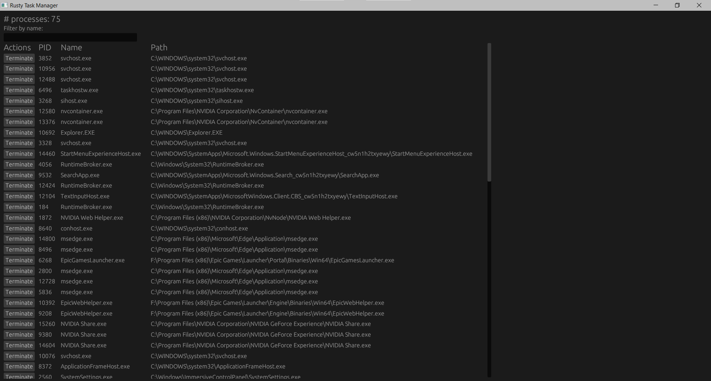

# rusty-task-manager
A simple task manager for Windows written in Rust (`egui` + `winapi`)

# TODO
- Ability to sort by column
- Ability to control refresh rate
- Viewing process command line parameters
- Viewing process memory usage
- Viewing process cpu usage
- Verifying process signatures (e.g., to detect malware)
- Ability to copy process info to clipboard
